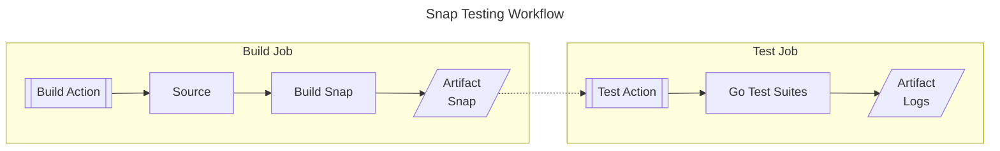

# Matter Snap Tests (WIP)
Test scripts, Github actions, and workflows for the [Matter](https://github.com/project-chip/connectedhomeip/tree/master) snaps.

The following diagram shows the Snap Testing workflow for building and testing snaps from upstream source code:


The Github Workflow configurations (triggers, jobs, etc) are maintained in respective upstream source codes.  
The Github Actions and testing suites are maintained in this repository.

## Test locally
This section includes example command to run tests.

Useful `go test` flags are:
- `-v` is to enable verbose output
- `-failfast` makes the test stop after first failure
- `-timeout 60m` extends the timeout to longer than the default 10m
- `-count 1` is to avoid Go test caching for example when testing a rebuilt snap

#### Run one testing suite
```bash
go test -v -failfast -count 1 ./test/suites/chip-tool
```

#### Run all suites
```bash
go test -p 1 -timeout 60m -failfast -count 1 ./test/suites/...
```

#### Run one suite with env variables
The environment variables are defined in [test/utils/env.go](./test/utils/env.go)

#### Test the testing utils
```bash
go test ./test/utils -count=10
```

## Test using Github Actions
This project includes two Github Actions that can be used in workflows to test snaps:
* [build](./build): Checkout code, build the snap, and upload snap as build artifact
* [test](./test): Download the snap from build artifacts (optional) and run smoke tests

A workflow that uses both the actions from `v2` branch may look as follows:

`.github/workflows/snap.yml`
```yaml
name: Snap Testing

on:
  pull_request:
    branches: [ main ]
  # allow manual trigger
  workflow_dispatch:

jobs:
  build:
    runs-on: ubuntu-latest
    steps:
      - name: Build and upload snap
        id: build
        uses: canonical/matter-snap-testing/build@v2
    outputs:
      snap: ${{steps.build.outputs.snap}}

  test:
    needs: build
    runs-on: ubuntu-latest
    steps:
      - name: Download and test snap
        uses: canonical/matter-snap-testing/test@v2
        with:
          name: device-mqtt
          snap: ${{needs.build.outputs.snap}}
```

